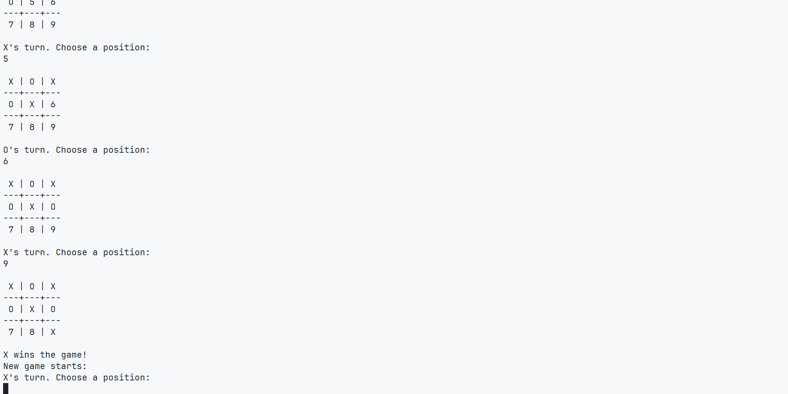

# ⭕❌ Tic-Tac-Toe

This is the tenth project from [The Odin Project](https://github.com/TheOdinProject) curriculum — a tic-tac-toe game on the command line where two human players can play against each other and the board is displayed in between turns.

## ✨ Preview

## 🎮 Gameplay Instructions

- Two players take turns entering a number from **1 to 9** to place their symbol (`X` or `O`) on the board.
- The board updates after each move and displays the current state in a 3×3 grid.
- The game automatically checks for a **winner** or a **draw** after every turn.
- A new game starts immediately after a win or draw.
- You can **quit anytime** by pressing `Ctrl + C`.

## 🛠️ Skills Learned

### ♦️ Ruby Basics

- Basic Data Types
- Variables
- Input and Output
- Arrays
- Hashes
- Methods
- Range
- Basic Enumerable Methods
- Linting and RuboCop
- Object Oriented Programming
- Project Management
